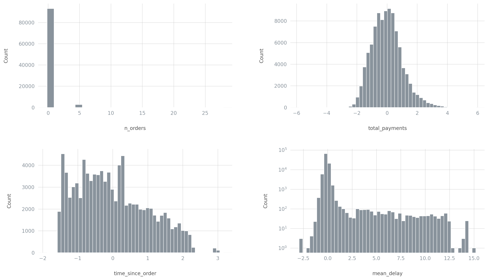
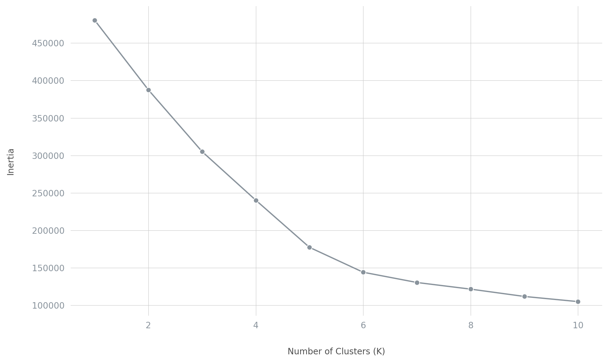
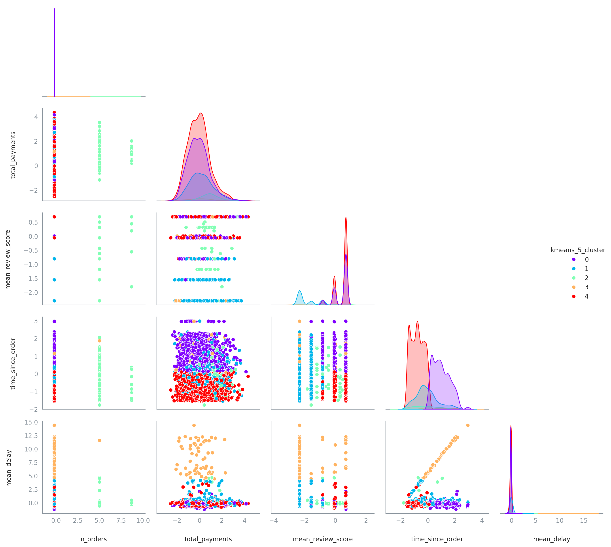

# Customer Segmentation

## Project Overview

This project aims to segment customers based on their transactional data using K-Means clustering technique. The goal is to identify distinct customer groups with similar characteristics, preferences, and behaviors, to enable targeted marketing.

## Data Description

The dataset used for this project consists of 104 478 records, each with the following features:

* **order features**:
  * order_id
  * order_status
  * order_purchase_timestamp
  * order_delivered_customer_date
  * order_estimated_delivery_date
  * payment_value
* **customer features**:
  * review_score
  * customer_unique_id

## Clustering

1. **Data Preprocessing**: The dataset was cleaned, transformed, and scaled to ensure consistency and comparability across features.
2. **K-Means Clustering**: The dataset was clustered using K-Means algorithm with [insert number] clusters. The optimal number of clusters was determined using the Elbow method and Silhouette analysis.
3. **Cluster Interpretation**: A typical customer profile for each cluster was determined based on the features separating the clusters the most.

### Data Preprocessing

CSV files including orders, customers, payments and review data are joined to create a dataset of 104 478 records with 8 features. The preprocessing steps include:
1. **Imputing** mean values
2. **Converting** date and times
3. **Log transforming** number of orders and total payments
4. **Standardizing** all numerical data

### K-Means Clustering

#### Number Of Clusters

The elbow plot is a technique for determining the optimal number of clusters (k) in the k-means algorithm. It involves running the k-means algorithm for different values of k and plotting the sum of squared errors (SSE) or inertia against the number of clusters. The SSE measures the compactness of the clustering, calculated as the sum of squared distances between each data point and its assigned cluster centroid.

As the number of clusters increases, the SSE decreases since data points are more tightly grouped within clusters. However, at some point, adding more clusters does not significantly reduce the SSE, and the plot forms an "elbow" shape. The optimal number of clusters is typically chosen at or near this elbow point, where increasing k further would not substantially improve the clustering quality while potentially leading to overfitting. The elbow plot provides a visual aid to balance the trade-off between minimizing SSE and avoiding an excessive number of clusters.

The elbow appears to be a **k = 5**. Therefore it is the number of clusters chosen for the following study. 

#### Silhouette Plot

The silhouette plot is a visualization tool that graphically displays how well each data point fits into its assigned cluster compared to other clusters. It consists of one or more silhouette bars, with each bar representing a cluster.The average silhouette coefficient across all data provides an overall clustering quality assessment. Silhouette plots are valuable for visually interpreting and validating clustering results and identifying misclustered points.

## Cluster Interpretation

A pair plot is a useful visualization tool for interpreting and validating clustering results across all feature pairs. By color-coding data points based on their assigned cluster labels, the pair plot displays scatter plots for every feature combination. Well-separated, distinct clusters across multiple scatter plots indicate successful clustering, while overlapping or poorly separated clusters may suggest issues with the clustering model or data.

The pair plot helps identify features contributing most to cluster separation, detect potential outliers or misclustered points, and gain insights into cluster characteristics across different feature combinations. This comprehensive view facilitates interpreting the clusters based on the features offering the maximum separation.

| Cluster | Description |
| --- | --- |
| **0 - Former satisfied customers** | - Customers whose last order is not recent - Positive mean review score - No delayed order |
| **1 - Dissatisfied with delays** | - Negative review scores - Short delays |
| **2 - Frequent buyers** | - Customers with multiple orders |
| **3 - High-risk customers** | - Customers with lost orders and/or long delays - Negative mean review score |
| **4 - New satisfied customers** | - Recent customers - Positive mean review score - No delayed order |

## Insights and Recommendations

* **Former Satisfied Customers**

  Implement a win-back campaign to re-engage these customers and encourage them to make new purchases
  Offer personalized promotions or discounts based on their previous order history and preferences
  Analyze the reasons behind their inactivity (e.g., product dissatisfaction, competitor offerings) and address any issues

* **Dissatisfied with Delays**

  Improve order fulfillment and logistics processes to minimize delays
  Offer compensation or incentives for customers affected by delays
  Enhance communication and provide real-time order tracking to manage expectations

* **Frequent Buyers**

  Develop a loyalty program to reward and retain these valuable customers.
  Offer exclusive deals, early access to new products, or personalized recommendations based on their purchase history.
  Analyze their buying patterns and preferences to optimize product offerings and marketing strategies.

* **High-Risk Customers**

  Implement stricter fraud detection and order verification processes for this high-risk segment.
  Improve customer service and order tracking to minimize lost orders and delays.
  Consider offering alternative payment or delivery options to mitigate risks.

* **New Satisfied**

  Focus on providing an exceptional onboarding experience for these new customers.
  Encourage them to leave reviews and share their positive experiences to attract more new customers.
  Cross-sell and upsell complementary products based on their initial purchases.

### Data Drift Analysis

To assess the stability of the customer segments and the need for model retraining, a data drift analysis was conducted. The analysis revealed:

* **Drift Detection**: A significant drift was detected in the data, indicating that the customer segments are not stable over time.
* **Drift Quantification**: The drift was quantified using metrics such as [insert metrics, e.g., KL-divergence, JS-divergence].
* **Retraining Frequency**: Based on the drift analysis, it is recommended to retrain the model every [insert frequency, e.g., 3 months] to ensure that the customer segments remain accurate and up-to-date.

### Technical Requirements

* **Python 3.x**
* **Scikit-learn library** for K-Means clustering
* **Pandas and NumPy** for data manipulation and analysis
* **Matplotlib and Seaborn** for data visualization

### Future Work

* **Segmentation Refining**: Refine the segmentation model by incorporating additional data sources (e.g., social media, customer feedback).
* **Segment Evolution**: Analyze the evolution of customer segments over time to identify trends and opportunities.
* **Segment-Specific Strategies**: Develop and implement segment-specific marketing, sales, and customer service strategies.

### Contact

For questions, feedback, or collaboration opportunities, please contact [Your Name] at [Your Email].
